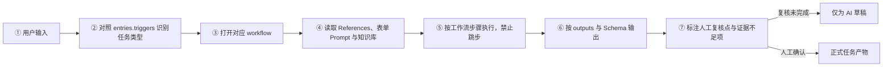

# TestPilot AI 测试助手与工作流升级需求文档

> 文档状态：已确认，核心功能已实现
>
> 需求来源：飞书《6.5 AI测试助手与工作流整合｜实操教程》（revision 54）
>
> 源文档：https://kxfgae3nvd.feishu.cn/wiki/ZMRywdQihicv8fkCJDmc6iWEnZe
>
> 适用产品：TestPilot 个人测试工作台
>
> 实施范围：需求文档、交互原型及工作台核心功能
> 更新日期：2026-08-26

## 1. 项目背景

当前 TestPilot 已提供用例、Bug、日志、SQL、回归、报告、知识库与全链路任务，但 AI 能力仍主要以“进入单项页面 → 输入文本 → 返回结果”的方式工作。随着任务和规则增加，只依赖长 Prompt 会出现以下问题：

- 同一句输入可能被不同模型解释为不同任务，入口不稳定；
- Bug、日志、SQL、回归等多项任务可能被合并成一段回答，步骤、证据和责任边界不清；
- 表单缺项时模型容易推测或补造信息；
- Prompt、工作流、输出格式和校验规则散落，修改后容易不同步；
- AI 不知道哪些是业务事实、哪些只是排查方法；
- 分析过程无法说明加载了什么规则、知识和历史 Bug；
- AI 输出未经人工勾选就可能被误认为正式结论；
- 测试人员难以用一条真实案例验证配置是否正确。

本次升级要把教程中已经落地的 `AI_Test_Knowledge_Base/ + ai_test_workbench/` 文件化能力映射为 TestPilot 页面能力，把 TestPilot 从“多个 AI 工具入口”提升为“有入口路由、有固定步骤、有业务知识、有机器校验、有人工门禁的测试调度器”。

## 2. 核心设计结论

### 2.1 知识库与工作台必须分离

| 领域 | 负责内容 | 示例 | 不应包含 |
|---|---|---|---|
| 知识库 | 已验证的业务事实与历史经验 | 历史 Bug、支付规则、接口异常、回归规则 | Prompt、任务步骤、输出格式 |
| 工作台资产 | 测试助手如何完成任务 | 入口路由、表单、工作流、Prompt、Schema、方法参考 | 未审核的业务事实 |
| References 方法库 | 如何识别、匹配和排查 | 模块映射、日志关键词、SQL 片段、历史 Bug 匹配方法 | 历史 Bug 正文副本 |

原则：工作台负责“怎么领任务、按什么步骤产出”；知识库负责“提供哪些可信业务事实”；References 负责“怎样进行匹配和分析”。

### 2.2 固定的执行链路



以上 7 步与正确源文档及 `SKILL.md` 保持一致。输入完整度校验发生在工作流的第一步；缺少核心字段时进入“证据不足项/需补充信息”，不得跳过后直接给根因。

### 2.3 多入口按顺序调度

同一输入可以命中多个入口，例如“支付成功但订单未支付，日志出现 lock wait timeout，版本刚修改支付回调”可同时命中 Bug、日志、SQL、回归。系统不得把多个任务并行混写为一段，而应：

1. 展示命中的入口、命中依据与置信度；
2. 标记一个主任务与若干辅助任务；测试人员可取消误命中的辅助入口；
3. 按 `dispatch.multi_route_policy: sequential_when_matched` 和 `dispatch.default_order` 创建父任务与顺序子任务；
4. 上一步的结构化产物传递给下一步；
5. 下一步仍缺少的输入单独提示；
6. 每个子任务独立保存、重试、审核和追溯。

教程联动案例的固定顺序：Bug 分析（主任务）→ 日志排查（辅助）→ SQL 分析（辅助）→ 回归清单（辅助）；可选增加 Prompt 测试，用于验证 `bug_analysis` Prompt 未退化。测试报告仅在输入明确包含测试结果、通过率或上线判断时进入路由。

### 2.4 文件资产到平台能力的映射

| 教程仓库资产 | TestPilot 页面能力 | 约束 |
|---|---|---|
| `workbench.yaml` | 入口路由与多入口调度 | 路由只维护一份，不再另建 router |
| `system/` | 全局强制规则 | 所有入口必须加载 |
| `workflows/` | 可视化步骤与联动工作流 | 禁止跳步 |
| `forms/` | 智能拆解与逐项表单 | 缺字段列“需补充信息” |
| `prompts/` | 正式 Prompt 资产 | 不另建待测 Prompt 副本 |
| `outputs/` | 测试人员可读的输出章节 | 与 Schema 同步 |
| `schemas/` | JSON Schema 机器校验 | 缺字段即不合格 |
| `references/` | 模块映射与分析方法 | 不复制知识正文 |
| `examples/` | 单入口样例、完整报告、联动 walkthrough | 用于练习与验证 |
| `../AI_Test_Knowledge_Base/` | TestPilot 独立知识库 | 直接引用，禁止在工作台复制一份 |

## 3. 产品目标

### 3.1 业务目标

- 测试人员只需提交一次上下文，系统即可识别并组织一个或多个测试任务；
- 每个任务严格按照可配置步骤运行，不因模型变化而跳步；
- 缺少信息时停止完整分析，并明确告诉测试人员缺什么、为什么需要；
- 所有输出都有来源、规则、知识、模型、版本与人工复核记录；
- 通过配置而非改代码维护入口、表单、工作流、Prompt 和输出格式；
- 用真实案例在沙箱中验证配置，确认后才发布到正式任务。

### 3.2 非目标

- 第一版不自动批准上线；
- 不让 AI 自动把分析结果发布为知识；
- 不直接执行生产 SQL 或调用外部自动化测试平台；
- 不把工作台配置表现为服务器文件编辑器，页面以业务化表单为主；
- 不在本次原型确认前修改现有正式页面与数据库。

## 4. 用户角色与关键场景

### 4.1 主要角色

- 测试执行者：提交任务、补齐信息、查看执行过程、复核结果；
- 工作台维护者：维护入口、规则、工作流、表单、Prompt、输出与方法参考；
- 知识维护者：审核业务事实、处理版本与引用关系。第一版可由同一位个人测试人员承担。

### 4.2 典型场景

输入：支付成功但订单显示未支付；日志出现 `lock wait timeout`；版本修改过支付回调。

预期过程：

1. 命中 Bug、日志、SQL、回归四个入口；
2. 识别为支付、订单、MQ 等候选模块；
3. 检查环境、版本、复现步骤、traceId、时间范围等字段；
4. 缺少 traceId 不阻塞 Bug 初步分析，但会阻塞完整日志链路还原；
5. 先生成 Bug 现象与证据清单，再排查日志时间线，再给 SQL 核对方向，最后生成回归范围；
6. 检索支付历史 Bug 和业务规则，但不得编造知识库不存在的标题；
7. 输出通过 Schema 后进入人工复核；
8. 未完成复核时只标记为“AI 草稿”，不得成为上线结论。

## 5. 信息架构升级

建议在左侧导航新增一级入口“AI 测试助手”，并将“配置中心”扩展为“工作台编排”。

```text
AI 测试助手
├── 发起任务
├── 执行记录
├── 组合任务
└── 案例验证

工作台编排
├── 入口路由
├── 全局规则
├── 工作流
├── 输入表单
├── Prompt
├── 输出模板
├── Schema
├── References 方法库
└── Examples 示例

知识库（保留现有独立入口）
├── 历史 Bug
├── 业务规则
├── 接口异常
├── 日志规律
├── SQL 经验
├── 压测经验
└── 回归规则
```

## 6. 功能需求

### FR-01 AI 测试助手首页

- 提供一个统一智能输入区，支持文本、附件和逐项填写；
- 展示入口卡片：用例、Bug、日志、SQL、回归、报告、Prompt 测试；
- 自动识别入口，也允许手工勾选；
- 显示最近执行、待补充、待复核、规则异常和高风险任务；
- 所有入口都复用相同的路由、表单校验、执行跟踪和人工复核框架。

### FR-02 入口路由

每个入口包含：

- 唯一 ID、名称、说明、启用状态；
- 关键词、正则、排除词和示例输入；
- 关联表单、Prompt、工作流和输出 Schema；
- 可读取的知识分类与 References 范围；
- 调度优先级和 `default_order`；
- 冲突规则、兜底入口与低置信度处理方式；
- 版本、发布状态和最近验证结果。

路由结果必须展示“命中原因”，禁止只给不可解释的分类结果。

第一版必须完整支持教程中的 7 个入口 ID：

| 入口 ID | 页面名称 | 典型触发特征 | 首要资产 |
|---|---|---|---|
| `testcase_gen` | 生成测试用例 | 需求、PRD、生成用例 | `forms/testcase.yaml`、`prompts/testcase_gen.txt` |
| `bug_analysis` | 分析 Bug | Bug、复现步骤、状态不一致 | `workflows/Bug分析工作流.md` |
| `log_triage` | 排查日志 | ERROR、Exception、traceId、timeout | `workflows/日志排查工作流.md` |
| `sql_analysis` | 分析 SQL | select、join、where、慢查询 | `workflows/SQL分析工作流.md` |
| `regression_list` | 生成回归清单 | 本次改动、版本、要回归 | `workflows/回归测试工作流.md` |
| `test_report` | 生成测试报告 | 测试结果、通过率、能否上线 | `forms/report.yaml`、`prompts/test_report.txt` |
| `prompt_test` | Prompt 测试 | Prompt 不稳定、每次不一样 | `workflows/Prompt测试工作流.md` |

关键词和正则统一对应 `entries[].triggers.keywords/patterns`；平台可视化维护后仍需保证可导出为同等结构，不允许再维护第二套路由配置。

### FR-03 全局规则

所有入口强制加载以下规则：

- 禁止跳过工作流步骤；
- 禁止无证据确认根因；
- 禁止虚构知识库标题、Bug 编号和业务规则；
- 禁止 AI 独自判断“可以上线”；
- 风险等级统一为 P0–P3；资金、订单状态、数据一致性等规则可强制提升风险；
- 输出中的事实、推测、待确认项必须明确区分；
- 人工复核项默认未勾选。

规则页面必须对应 `system/AI测试工作台总规则.md`、`system/风险等级规则.md`、`system/人工复核规则.md`，共享调度与输出禁令对应 `prompts/_shared_output_rules.txt`。SQL 分析风险枚举使用 P0–P2，其余入口使用 P0–P3。

规则修改需要版本、变更说明、影响入口数量和案例验证结果，不能直接静默覆盖。

### FR-04 输入表单与缺失提醒

- 每个入口有独立 YAML 逻辑对应的可视化表单；
- 字段支持必填、条件必填、可选、默认值、类型、示例和脱敏提示；
- 支持整段文本自动拆解为字段；
- 缺失面板展示字段、缺失原因、影响步骤和补齐入口；
- 缺少核心字段时不得执行“完整分析”，可保存草稿或生成明确标记的有限分析；
- 多入口任务先复用公共字段，再显示各入口独有缺项。

Bug 默认必填：标题、复现步骤、实际结果、预期结果、环境。日志片段和 traceId 可配置为条件必填。

### FR-05 工作流编排

- 工作流由有序步骤组成，支持必选、可选、条件分支和人工节点；
- 每步定义输入、输出、前置条件、超时、重试、失败处理和下游映射；
- 单入口工作流独立维护，联动工作流只负责跨入口编排；
- 支持可视化查看顺序和依赖，不要求用户编辑 Markdown 文件；
- 执行时展示当前步骤、已完成步骤、阻塞原因和下一步；
- 工作流版本必须绑定到每次任务快照。

Bug 固定步骤：输入校验 → 提取问题现象 → 判断影响模块 → 推荐日志方向 → 推荐 SQL 方向 → 关联历史 Bug → 输出回归范围 → 判断风险等级 → 人工复核。

日志固定步骤：提取关键词 → 识别异常类型 → 分析调用链 → 定位疑似模块 → 匹配历史规律 → 输出排查建议 → 证据不足时列补充信息。

SQL 固定步骤：风险识别 → WHERE → 索引判断（只建议验证）→ 慢查询 → JOIN → ORDER BY → 性能风险 → 含 EXPLAIN 的优化建议。没有 EXPLAIN 或数据量时禁止断言“必须加某索引”。

回归固定步骤：识别直接改动 → 上下游影响 → 沿业务链路补遗漏 → 关联历史 Bug → 标记风险 → 输出必须/建议回归清单 → 人工复核。必须回归项不少于 6 条。

### FR-06 Prompt 资产

- Prompt 由系统规则、任务工作流、References、知识检索结果、表单变量和输出要求组装；
- 页面展示 Prompt 组成清单，不默认暴露 API Key 或敏感上下文；
- 支持变量检查、未绑定变量提示、Token 预估和预览；
- 每次模型调用记录 Prompt 版本和资产版本；
- 修改 Prompt 后必须经过案例验证才能发布；
- 多入口调度规则放在共享输出规则中，不新增一个不可维护的超长编排 Prompt。

### FR-07 输出模板与 Schema

- 输出模板面向测试人员，定义章节、字段顺序、说明和展示方式；
- Schema 面向机器，校验字段、类型、枚举、必填和嵌套结构；
- 两者视为同一资产对，保存时执行一致性校验；
- 任一方改动后，另一方显示“待同步”；
- Schema 失败时展示字段级错误，可自动修复一次，仍失败则进入人工补充；
- 输出必须同时提供结构化结果和一行摘要，便于下游任务传递。

`bug_output` 必须校验以下 10 个字段：`phenomenon`、`affected_modules`、`possible_causes`、`recommended_logs`、`recommended_sql`、`related_history_bugs`、`regression_scope`、`risk_level`、`human_review_points`、`need_more_info`。缺少任一字段即视为不合格，要求按对应 `outputs/` 重出或人工补齐。

多入口最终章节顺序固定为：任务识别 → Bug 分析（若有）→ 日志排查（若有）→ SQL 分析（若有）→ 回归建议（若有）→ 测试报告（若有）→ Prompt 测试（若有）→ 人工复核清单 → 证据不足项。

### FR-08 References 方法库

- 按入口维护模块映射、日志关键词、SQL 片段、风险信号、表结构说明和历史 Bug 匹配算法；
- References 只保存方法和索引，不复制知识库事实正文；
- 历史 Bug 映射只记录案例 ID、目标知识和相似度规则；
- 支持按项目、模块和版本配置覆盖项；
- 执行详情显示实际加载的参考项和命中依据。

教程中的关键方法资产必须可定位到：`references/bug-analysis/`、`references/log-analysis/log_pattern_history.md`、`references/sql-analysis/sql_risk_signals.md`、`references/regression-test/history-bugs-payment.md`。`references/bug-analysis/history-bugs.md` 只保存案例 ID、目标知识文件与相似度方法，不保存 Bug 正文。

### FR-09 知识库检索

- 每个入口配置允许访问的知识分类、模块和最大召回数量；
- 只使用已发布知识；
- 结果显示标题、版本、模块、相似度、来源任务和引用片段；
- 无命中时明确显示“未找到已发布知识”，不得由模型补造；
- 任务保存本次使用的知识版本快照；
- 任务结果入库继续沿用现有人工审核和撤销依赖保护。

入口与知识目录的默认映射：

| 入口 | 读取目录 |
|---|---|
| `bug_analysis` | `historical_bugs/`、`log_patterns/`、`sql_experience/`、`business_rules/` |
| `log_triage` | `log_patterns/`、`historical_bugs/` |
| `sql_analysis` | `sql_experience/`、`performance_experience/` |
| `regression_list` | `regression_rules/`、`historical_bugs/` |
| `testcase_gen` | `business_rules/`、`api_exceptions/`、`historical_bugs/` |

支付案例优先引用《支付历史Bug》《订单历史Bug》《常见日志异常规律》《SQL风险规则》《支付模块回归规则》《支付业务规则》《支付接口异常规则》等已发布知识；库中没有的标题必须显示“需补充信息”。

### FR-10 执行详情与证据链

执行详情需要分为六个区域：

1. 原始输入与解析后的表单；
2. 路由命中与调度顺序；
3. 工作流时间线；
4. 加载的规则、References 和知识；
5. 模型、Prompt、输出 Schema 校验；
6. 人工复核与正式产物。

每一步记录状态、耗时、输入摘要、输出摘要、错误、重试和操作者。高风险内容需突出证据来源。

### FR-11 人工复核门禁

- 复核项默认全部未勾选；
- 支持逐项确认：现象、证据、模块、根因措辞、影响范围、风险、回归范围、敏感信息；
- P0、资金、订单状态和不能上线候选结论必须额外确认；
- 未完成必选复核时产物状态为“AI 草稿”；
- 完成复核后才允许提交审核、生成正式报告或发布知识；
- 上线结论必须由测试人员选择，AI 只能给风险建议。

### FR-12 案例验证沙箱

- 提供官方示例和用户自建案例；
- 示例包含完整输入、期望路由、期望缺项、期望模块、输出关键断言和禁止项；
- 支持对草稿配置运行，不影响正式任务；
- 比较修改前后结果，显示路由、字段、Schema 和断言差异；
- 配置发布前至少通过指定必跑案例；
- 内置“支付成功但订单未支付 + lock wait timeout + 支付回调改动”联动案例。

案例来源与教程保持一致：`examples/bug_input.md`、`examples/log_input.md`、`examples/sql_input.md`、`examples/prompt_input.md`、`examples/sample_logs/`、`examples/sample_sql/`、`examples/regression-test/sample_release_*.md`、`examples/walkthrough-支付成功订单未支付-完整材料.md`，并可对照 `examples/bug-analysis/`、`log-analysis/`、`sql-analysis/` 的完整报告。

### FR-13 配置发布与版本

- 资产状态：草稿、待验证、可发布、已发布、已停用；
- 入口、规则、工作流、表单、Prompt、输出/Schema、References 均独立版本化；
- 发布时生成一份不可变“工作台版本包”；
- 任务绑定版本包，后续配置变化不篡改历史过程；
- 发布前展示受影响入口、任务类型和必跑案例；
- 支持回滚到上一已发布版本，但不回滚历史任务数据。

## 7. 页面设计

### 7.1 AI 测试助手 / 发起任务

布局：左侧输入与附件；右侧为入口识别、输入完整度和执行顺序。关键交互：

- 输入内容后点击“识别并预检”；
- 自动勾选命中入口并展示命中原因；
- 缺项按“阻塞/建议补充”分组；
- 用户确认入口和顺序后才创建任务；
- 可切换“整段输入 / 逐项填写”。

### 7.2 执行详情

顶部展示父任务、风险、工作台版本、总体进度；中间是顺序步骤时间线；右侧固定显示证据、规则、知识和人工复核。点击步骤打开输入、输出、Prompt 版本、模型和 Schema 校验详情。

### 7.3 工作台编排

左侧为九类资产导航，中间为资产列表，右侧为编辑/预览。入口详情将表单、Prompt、工作流、知识范围和 References 关联在同一页，避免配置分散。

### 7.4 案例验证

左侧选择案例和配置版本；中间运行并展示每一步；右侧显示断言结果和版本差异。通过后可将草稿标记为“可发布”。

## 8. 数据模型建议

| 实体 | 核心字段 |
|---|---|
| workbench_release | 版本、状态、变更说明、发布时间、资产快照 |
| entry_route | ID、触发器、优先级、关联资产、知识范围、状态、版本 |
| global_rule | 类别、内容、强制级别、适用入口、版本 |
| workflow_definition | 步骤、条件、输入输出映射、重试、版本 |
| form_definition | 字段、必填/条件必填、示例、脱敏规则、版本 |
| prompt_asset | 模板、变量、资产引用、版本 |
| output_template | 章节、字段、展示规则、版本 |
| output_schema | JSON Schema、模板配对、校验状态、版本 |
| reference_asset | 类型、项目/模块范围、方法内容、版本 |
| validation_case | 输入、期望路由、断言、禁止项、必跑标记 |
| workflow_run | 父任务、入口顺序、版本包、状态、风险、缺项 |
| step_run | 步骤、输入/输出快照、模型、耗时、错误、重试 |
| review_check | 复核项、是否必选、结论、时间 |

现有任务、知识、用例、回归、报告与审计表继续保留，通过版本和关联实体扩展，不要求一次性重构全部历史数据。

## 9. 状态规则

### 9.1 任务状态

草稿 → 待预检 → 待补充 → 可执行 → 执行中 → 待复核 → 已确认 → 已完成；异常分支为阻塞、执行失败、已取消。

### 9.2 步骤状态

未开始、等待输入、执行中、已完成、Schema 失败、等待人工、阻塞、已跳过。

### 9.3 结论等级

- P0：资金、订单状态、严重数据一致性、核心链路不可用；
- P1：主要功能不可用或高概率影响核心业务；
- P2：局部功能或有替代方案的问题；
- P3：低影响体验、提示或优化项。

风险规则可给出最低等级，AI 不得擅自降低强制风险。

## 10. 安全、审计与异常处理

- API Key 继续保存在 macOS Keychain，不写入 Prompt 快照；
- 日志、SQL、附件和模型输入支持脱敏提示；
- 每次调用记录厂商、模型、耗时、状态和错误，不记录明文 Key；
- 资产修改、验证、发布、回滚、人工复核均进入审计；
- 模型不可用时可使用本地规则完成路由和完整度检查，但不得伪造 AI 分析成功；
- 工作流中途失败时保存已完成步骤，允许从失败步骤重试；
- 知识库无命中、Schema 失败、变量缺失等情况必须显式展示。

## 11. 与现有 TestPilot 的兼容方案

- 现有“快捷任务”升级为“AI 测试助手”的统一输入能力；
- Bug、日志、SQL 独立页面继续保留，作为强制指定入口的快捷方式；
- 现有“全链路任务”升级为联动工作流管理与运行记录；
- 现有“格式模板”扩展为输出模板 + Schema 配对；
- 现有“关联规则”扩展为入口路由与知识/References 范围；
- 现有知识库继续只管理事实，不混入 Prompt 和工作流；
- 旧任务可查看，不强制迁移为新版本包；新任务使用新执行链路。

## 12. 验收标准

1. 7 个入口 ID 与教程一致，并能由关键词、正则或手工指定正确进入；
2. 一段支付异常输入能识别 `bug_analysis` 为主任务，`log_triage`、`sql_analysis`、`regression_list` 为辅助任务，并解释命中原因；
3. 多入口按 `sequential_when_matched` 和 `default_order` 顺序执行，不合并为不可追溯的一段输出；
4. Bug 缺少环境或复现步骤时明确阻塞并定位字段；
5. 系统能显示每一步加载的总规则、工作流、References、Prompt、知识和输出 Schema；
6. 知识库无结果时不生成虚假知识标题，只列“需补充信息”；
7. Bug 输出包含教程规定的 10 个必填字段；
8. SQL 没有 EXPLAIN 或数据量时不武断要求新增某个索引；
9. 回归必须项不少于 6 条，并覆盖支付、订单、库存、优惠券等关联模块；
10. 多入口输出章节顺序与 `_shared_output_rules` 一致；
11. 人工复核未完成时不能生成正式质量结论或发布知识；
12. P0 与 Prompt“通过”必须人工终审，AI 不能独自选择“可上线”；
13. 使用 walkthrough 可一次跑通联动流程，且末尾至少有 2 条人工复核点；
14. 历史任务始终使用当时的工作台版本包，配置升级不改写历史证据；
15. 现有用例、回归、报告和知识关联继续可用。

## 13. 建议分期（待确认后实施）

### Phase 1：可配置执行骨架

入口路由、表单完整度、顺序工作流、执行详情、人工复核、版本快照。

### Phase 2：资产编排中心

全局规则、Prompt、输出模板/Schema、References、发布与回滚。

### Phase 3：案例验证与质量度量

案例沙箱、断言对比、配置回归、路由准确率、Schema 通过率、人工修改率。

## 14. 本轮需要用户确认的决策

1. 左侧导航是否将“快捷任务”直接升级为“AI 测试助手”，还是保留旧入口做兼容跳转？
2. “工作台编排”是否作为独立一级导航，还是放入配置中心？
3. 是否严格按教程的 `default_order` 固定执行，只允许取消误命中的辅助入口，不允许临时拖动改变顺序？
4. 缺少非核心信息时是否允许输出明确标记的“有限分析”？
5. `examples/` 是仅作为练习材料，还是同时作为配置发布前的自动断言案例？
6. Prompt 测试第一阶段是否进入正式任务列表，还是只在案例验证沙箱中运行？

修订后的原型默认答案是：快捷任务升级为 AI 测试助手；工作台编排独立显示；联动任务严格遵循默认顺序；核心字段缺失禁止完整分析、非核心字段允许有限分析；Examples 同时承担练习与验证；Prompt 测试作为正式入口，但“通过”结论必须人工终审。
